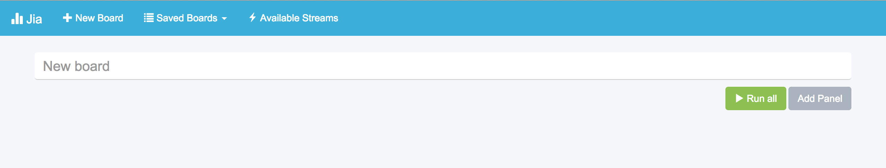
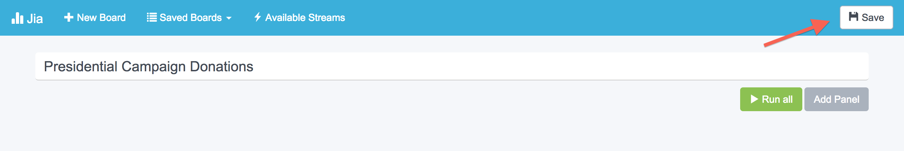
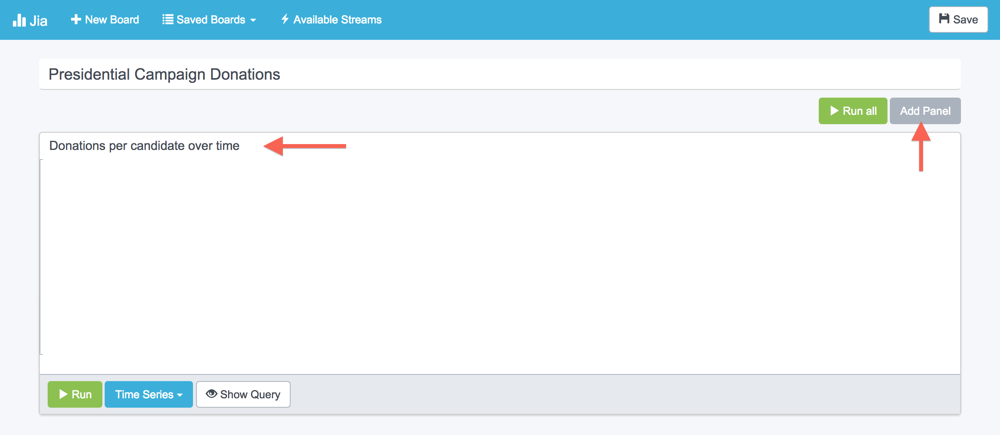
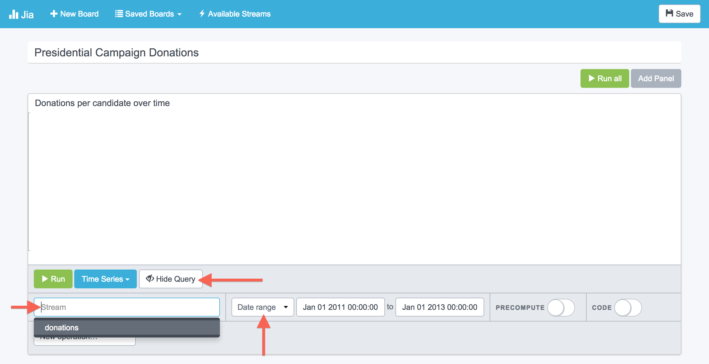
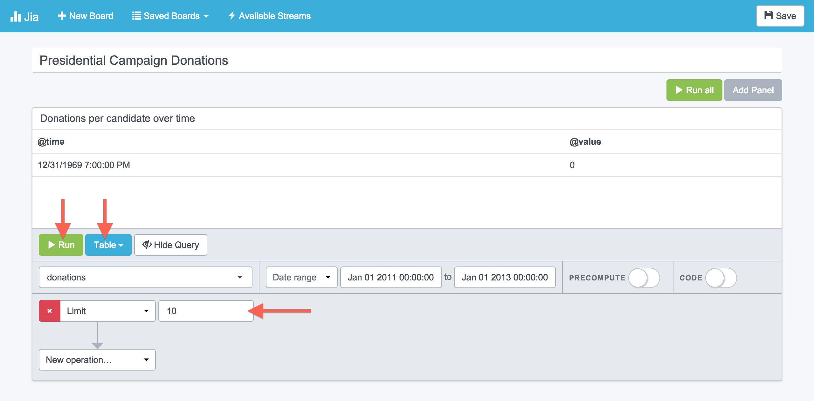
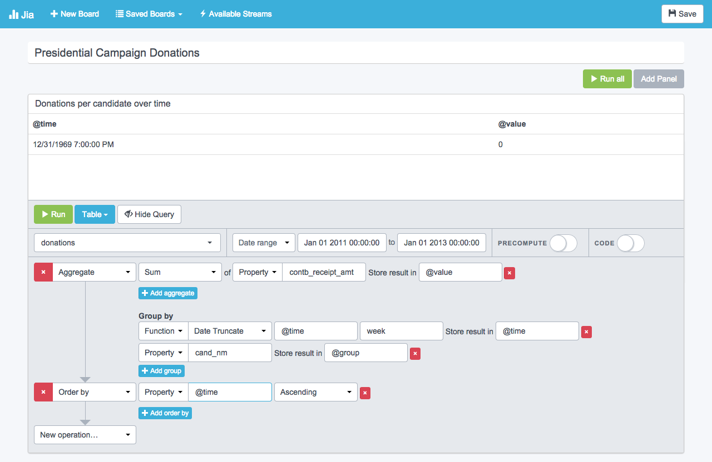
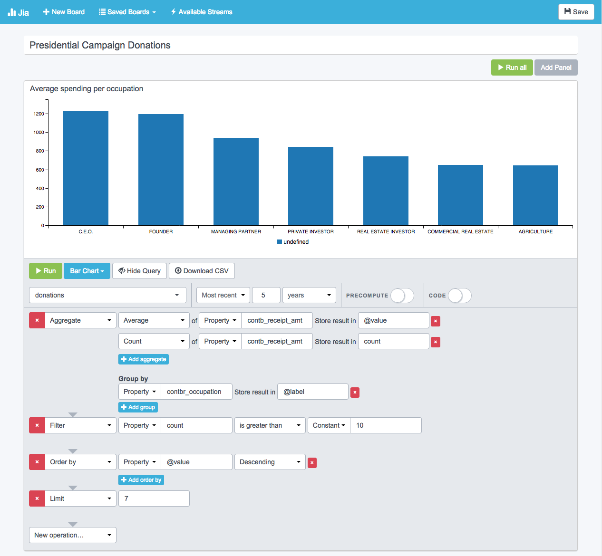

Jia
===

## Get running in 5 minutes

In this tutorial, we'll walk through all the steps necessary to start exploring
and visualizing some data using Jia. Kronos comes with a convenient script to
import some
[presidential campaign donation data](http://fec.gov/disclosurep/PDownload.do)
from Oregon to play around with, so that is the dataset we will dig into.

Start by getting [Kronos](https://github.com/Locu/chronology/tree/master/kronos)
and [Metis](https://github.com/Locu/chronology/tree/master/metis) instances up
and running. You can follow their respective getting started guides for further
instruction. You don't need to complete the full exercies, just get the server
instances running.

Don't forget to import the campaign data into Kronos.

```bash
cd chronology/kronos
python scripts/load_test_elections_data.py
```

Once you have Kronos and Metis running, configure Jia.

```bash
cd chronology/jia
sudo pip install -r requirements.txt
cp settings.py.template settings.py
```

Edit `settings.py` to your liking. Most settings should be fairly
straightforward. Be sure to set `KRONOS_URL` and `METIS_URL` to reflect the
ports you chose when setting those up.

You most likely want to set `PRECOMPUTE` to false for the time being. If you
do, you don't need to worry about any of the `CACHE_` or `SCHEDULER_` settings.
For more information on precompute, see
[the scheduler docs](https://github.com/Locu/chronology/blob/master/jia/README.md#task-scheduler).

For the purposes of this demonstration, you can leave `ENABLE_GOOGLE_AUTH`
disabled. When deploying Jia for everyday use, you need to visit the
[Google Developers Console](https://console.developers.google.com/) and create
a project in order to get API keys for authentication. Put the client ID and
secret keys in the settings, and whitelist any allowed users' email addresses
in the `ALLOWED_EMAILS` setting. You can add individual email addresses here,
or whitelist an entire regex, which can be useful if your company uses Google
Apps.

When you are done configuring, simply run
```
./manage.py --config settings.py db upgrade
```
to initialize the database, then
```
./manage.py --config settings.py runserver
```
to start the Jia server. Visit [http://localhost:8152](http://localhost:8152)
(or whatever port you configured Jia to run on) in a browser and you should see
this:



This is your first board. A board can have multiple panels. Each panel contains
one query and displays one visualization. Call your board something like
"Presidential Campaign Donations" and hit "Save".



You will be able to get back to this board at any time via the "Saved Boards"
dropdown on the toolbar.

The first query we will visualize is a breakdown of donations by candidate over
time. Start by adding a panel to your board and giving it a name.



Hit the "Show Query" button to expand the query builder. Select a stream first.
When working with the elections dataset, we only have one choice. Switch the
timeframe from "Most recent" to "Date range" and specify a two year span from 
January 1, 2011 to January 1, 2013.



This will return about 100,000 events, so let's spare our browsers and set a
limit of 10. At this point we just want to see what format the data is in.
Set the visualization mode to "Table" and press "Run".



Table view is useful for seeing what properties you have available on a given
stream. By reviewing these 10 sample events, we can see that
`contb_receipt_amt`, `cand_nm`, and `@time` are of particular interest for the
query we are building.

We are aiming for a line graph, which expects fields named `@time` (x-axis),
`@value` (y-axis), and, optionally, `@group` (to create separate lines).

Clear the limit of 10 you previously set and add an aggregate. We want to sum
the property `contb_receipt_amt` and store the result in `@value` so it shows
up on the y-axis.

We want to group by two fields on this aggregation. Summing donations per week
seems to be an appropriate resolution, so make the first group a date truncate
function on `@time` by `week`. Store the result back in `@time`.

We also want to group by the candidate name (`cand_nm`). Otherwise we would just
see total donations per week over time. Store this result in `@group` so the
line graph knows how to draw the separate lines.

Lastly, we need to add one additional query step. The line graph expects the
result set to be ordered by `@time`. Let's do that.

Here is what our completed query looks like.



Switch the visualization type of this panel from "Table" to "Timeseries" and
hit run. It will take a moment to run the aggregation, but you should be
rewarded for your patience with a nice timeseries plot.


Our 5 minutes are up, but if you're having as much fun as we are, we can do one
more. This data set tells as much about the donors as it does about the
candidates. Let's find out which occupations make the extravagant and the most
modest donations. We can plot this using a bar graph. Bar graphs expect a
`@value` and a `@label`. They also accept an optional `@group` for stacked bars.

Add another panel to your board. Set the stream name and timeframe like we did
last time. If you are lazy, you can just choose the most recent five years to
the same effect.

Again, we must start with an aggregation. We want to find the average 
`contb_receipt_amt` and store that in `@value`. Group by `contbr_occupation`
and store that in `@label`.

Note: this 5-minute guide isn't an introduction to statistical significance
testing, but be careful when you look at aggregate statistics like this. If
there is one Chief Widget Officer on file, that individual's spending alone
shouldn't define the average spending for a Chief Widget Officer. Add a "Count"
aggregate on the `contb_receipt_amt` field and store the result in a field
called `count`. Then filter to make sure `count` is greater than the constant
value `10`.

Order by `@value` in descending order and limit the results to something in the
5-15 range. This will show us the top-spending occupations.

Here is our completed query:



Switch the visualization type to "Bar Chart" and hit "Run." Depending on your
screen width, the labels along the x-axis might be crunched. You can either
reduce the limit or just hover over the bars to see their labels. Now you know
who to approach for donations if you ever decide to run for president!

To see the most modest spenders, just flip the "Order by" from descending to
ascending. Pretty cool!

For additional practice, try answering some of these questions using Jia:
 * Which candidate had the highest average donation amount?
 * What do donations look like over the course of a week? Is there more activity
   on weekdays or weekends? (Hint: use the "Date part" function)
 * Which day of the campaign brought in the most total donations?

## FAQs
#### Why don't I see any stream names?
Check to make sure the Kronos URL and default namespace in your Jia
configuration match those in your Kronos configuration.

#### Why is x not working?
File an [issue](https://github.com/Locu/chronology/issues/new)!

## Task Scheduler
The Jia task scheduler can be used to enable the precomputation of long-running
queries so the results are always ready when you visit the dashboard.

### Running
The scheduler settings can be edited in Jia's settings file. You can create a
copy from `settings.py.template`.

```
# Precompute settings
PRECOMPUTE = True
CACHE_KRONOS_URL = 'http://localhost:8150' # The cache is written here
                                           # Can be the same as KRONOS_URL
CACHE_KRONOS_NAMESPACE = 'locu_computed' # The namespace for cache streams
SCHEDULER_HOST = '127.0.0.1' # It is not recommended to expose the scheduler outside the LAN
SCHEDULER_PORT = 8157
SCHEDULER_DATABASE_URI = 'sqlite:///%s/scheduler.db' % APPROOT
```

Before running the scheduler for the first time, the database must be initialized.
This only needs to be done once.

```
$ ./scheduler.py --config settings.py db upgrade
```

Always use the following command to start the scheduler. Never serve the
scheduler app from another WSGI server (see the top of [commands/runscheduler.py](commands/runscheduler.py)
for details).
```
$ ./scheduler.py --config settings.py runserver
```

#### Scheduler options
* `--config` Specify a config file to override default settings. Must immediately follow `./scheduler.py`.
* `--port` Specify a port to run the scheduler on. Must follow the `runserver` command.

Example:
```
$ ./scheduler.py --config settings.py runserver --port 8999
```

Try `./scheduler.py --help` for more info.

### Scheduling
In addition to precompute tasks, you can send the scheduler any Python code
you want executed on a regular basis. The scheduler client API provides access
to `schedule` and `cancel` methods.
```
from scheduler.client import schedule, cancel

# Prints jia every 5 seconds
result = schedule("print 'jia'", 5)

if result['status'] != 'success':
  print result['reason']
  exit()

# Unschedule the task we just made
result = cancel(result['id'])

if result['status'] != 'success':
  print result['reason']
```


## Creating/Installing Visualizations

Visualizations are stored in `/static/app/board/visualizations`. Each Jia visualization is made up of an Angular module and a template. The name of the module must be prefixed with `jia` (for example: `jia.example`). In order to install a visualization, add it as a dependency to the `boardApp` in `board.js`. Also add any necessary JavaScript or CSS dependencies to `board.html`.

The visualization module must define a factory that matches its title (sans the `jia` prefix). This factory should return a `function` that can be instantiated to represent each instance of the visualization in the UI, as well as a `meta` object that contains some parameters about the type of visualization. The factory should return both.

```
return {
  meta: { title: 'example', ... },
  visualization: function () { ... }
}
```

A full example of the simplest possible visualization:

`example.html`
```html
<div>{[ module.data ]}</div>
```

`example.js`
```javascript
var module = angular.module('jia.example', []);

module.factory('example', function () {

  var meta = {
    title: 'example',
    readableTitle: 'Example',
    template: 'example.html',
  };

  var visualization = function () {
    this.meta = meta;
    this.data = [];
    
    this.setData = function (data, msg) {
      this.data = data;
    }
  }

  return {
    meta: meta,
    visualization: visualization
  }
  
});
```

### Meta Parameters
#### `title`
The title of the visualization. Should match the filename and the angular name
after the `jia` prefix.

#### `readableTitle`
A title for the visualization that will be shown to the user in the UI.

#### `template`
The relative path to the visualization template. This template may contain 
angular directives. It has access to a `module` variable, which is an
instantiation of the visualization returned by this factory.

### Future Meta Parameters
#### `css` and `js`
Eventually, css and js dependencies could be specified in lists lazy loaded,
so editing board.html will not be necessary to install a visualization.

#### `requiredFields` and `optionalFields`
When the UI query builder becomes more advanced, it might be helpful for it to
have information on what visualizations can display what kinds of data.
